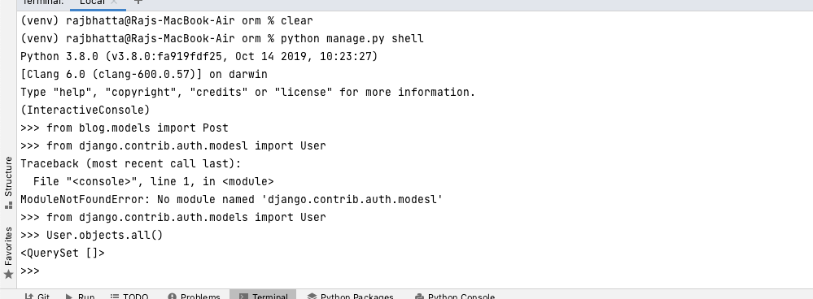

# How to work with ORM in Django #
## Modify blog/model.py ##
```python
from django.db import models

# Create your models here.

```

## class Post(models.Model): ##
- Each class represents table in the database

```python
from django.db import models
from django.utils import timezone
from django.contrib.auth.models import User

# Create your models here.
class Post(models.Model):
    title = models.CharField(max_length=100)
    content = models.TextField()
    date_posted = models.DateTimeField(default=timezone.now);
    author = models.ForeignKey(User, on_delete=models.CASCADE)

```

# Run migration to the database #
```python
python manage.py makemigrations
```

## It create file inside blog/migrations/0001_initial.py ##
```python
# Generated by Django 4.0.3 on 2022-04-05 03:58

from django.conf import settings
from django.db import migrations, models
import django.db.models.deletion
import django.utils.timezone


class Migration(migrations.Migration):

    initial = True

    dependencies = [
        migrations.swappable_dependency(settings.AUTH_USER_MODEL),
    ]

    operations = [
        migrations.CreateModel(
            name='Post',
            fields=[
                ('id', models.BigAutoField(auto_created=True, primary_key=True, serialize=False, verbose_name='ID')),
                ('title', models.CharField(max_length=100)),
                ('content', models.TextField()),
                ('date_posted', models.DateTimeField(default=django.utils.timezone.now)),
                ('author', models.ForeignKey(on_delete=django.db.models.deletion.CASCADE, to=settings.AUTH_USER_MODEL)),
            ],
        ),
    ]

```

# Viewing in the editor #
```python
 python manage.py sqlmigrate app_name(blog) migration_number(001)
```

# Run migrate command to migrate to the production database #
```python
python manage.py migrate
```

# How to query the database using model and shell #
```python
python manage.py shell
```

# Import post model and user by typing in console like #


