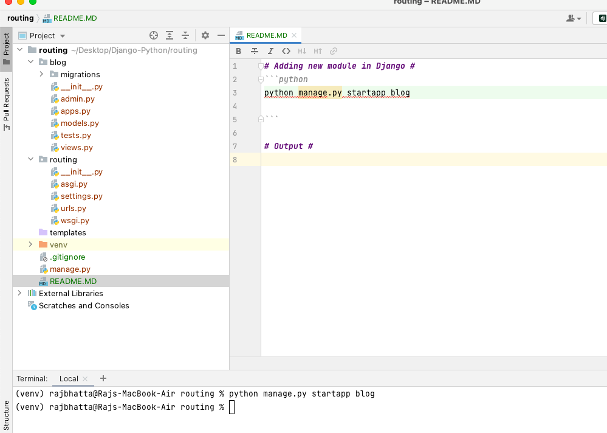

# Routing in Django #


# Adding new module in Django #
```python
python manage.py startapp blog

```

## Output ##



# Creating view #
## 1. State of blog/view.py ##
```python
from django.shortcuts import render

# Create your views here.

```

## 2. Modify blog/view.py ##
```python
from django.shortcuts import render
from django.http import HttpResponse

# Create your views here.
def home(request):
    return HttpResponse('<h1> Blog Home </h1')

```

# 3. Map url #
## create url.py inside blog ##
```python
it does not have anything
```

## copy url.py from main folder and modify like ##
```python

from django.contrib import admin
from django.urls import path
from . import views

urlpatterns = [
    # path('', view, function_name)
    path('', views.home, name='blog-home'),

]

```

# 4. modify main url.py #
```python
"""routing URL Configuration

The `urlpatterns` list routes URLs to views. For more information please see:
    https://docs.djangoproject.com/en/4.0/topics/http/urls/
Examples:
Function views
    1. Add an import:  from my_app import views
    2. Add a URL to urlpatterns:  path('', views.home, name='home')
Class-based views
    1. Add an import:  from other_app.views import Home
    2. Add a URL to urlpatterns:  path('', Home.as_view(), name='home')
Including another URLconf
    1. Import the include() function: from django.urls import include, path
    2. Add a URL to urlpatterns:  path('blog/', include('blog.urls'))
"""
from django.contrib import admin
from django.urls import path

urlpatterns = [
    path('admin/', admin.site.urls),
]

```

### into ###
```python
"""routing URL Configuration

The `urlpatterns` list routes URLs to views. For more information please see:
    https://docs.djangoproject.com/en/4.0/topics/http/urls/
Examples:
Function views
    1. Add an import:  from my_app import views
    2. Add a URL to urlpatterns:  path('', views.home, name='home')
Class-based views
    1. Add an import:  from other_app.views import Home
    2. Add a URL to urlpatterns:  path('', Home.as_view(), name='home')
Including another URLconf
    1. Import the include() function: from django.urls import include, path
    2. Add a URL to urlpatterns:  path('blog/', include('blog.urls'))
"""
from django.contrib import admin
from django.urls import path, include

urlpatterns = [
    path('admin/', admin.site.urls),
    path('blog/',include('blog.url'))
]

```